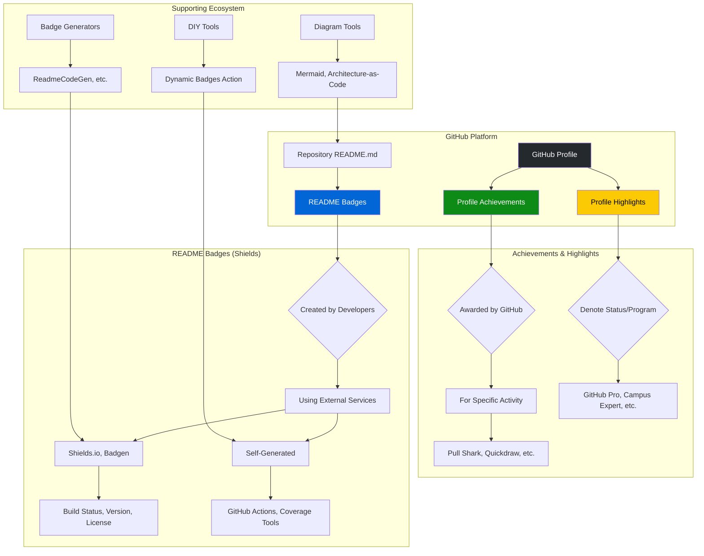
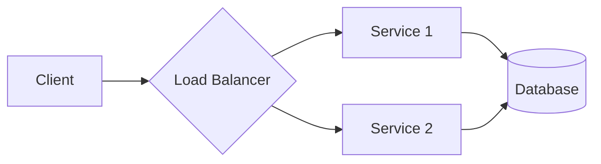

# 🏆 GitHub Badge Ultimate Guide | The Master Compendium


<div align="center">

### **The Definitive Source of Truth for GitHub's Visual Identity Ecosystem**

Navigate the complete spectrum of GitHub's recognition systems. This guide is the cornerstone reference that demystifies **Achievements, Profile Highlights, and README Badges**, providing clarity, context, and actionable knowledge for every developer.

[](https://github.com/AshrafMorningstar/GitHub-Badge-Ultimate-Guide/wiki)
[](#-contributing-to-the-ultimate-guide)

</div>

## 📖 Introduction: The Triad of GitHub Recognition

GitHub employs three distinct, powerful visual systems to showcase activity, status, and quality. Understanding their differences is the first step to mastering your GitHub presence.

This guide serves as the **central nervous system** for this knowledge, connecting concepts, tools, and communities. It is not just documentation—it is a living, evolving map of the ecosystem.

## 🏗️ The Complete System Architecture

The diagram below illustrates the relationships and scope of the three core recognition systems on GitHub and the tools that support them.



## 🔍 Part 1: Profile Achievements & Highlights

These are **earned badges and status indicators** that appear directly on your GitHub profile, awarded by GitHub itself.

### 🏅 **Profile Achievements**
Awarded automatically for specific, verifiable activities within the GitHub community.

| Achievement | How to Unlock | Tier System |
|-------------|---------------|-------------|
| **Pull Shark** 🦈 | Get a pull request merged. | Bronze (2), Silver (16), Gold (128) |
| **Quickdraw** ⚡ | Close an issue or PR within 5 minutes of opening. | Base level only |
| **Starstruck** 🌟 | Have a repository reach 16 stars. | Base level only |
| **Galaxy Brain** 🧠 | Have 2 accepted answers in GitHub Discussions. | Base level only |
| **Public Sponsor** ❤️ | Sponsor an open source developer via GitHub Sponsors. | Base level only |

### 💎 **Profile Highlights**
These badges denote special status or membership in GitHub programs.

| Highlight | Represents |
|-----------|------------|
| **GitHub Pro** | An active paid GitHub Pro subscription. |
| **Security Bug Bounty Hunter** | Successfully reporting a security vulnerability. |
| **GitHub Campus Expert** | Being a student leader in the Campus Program. |
| **Developer Program Member** | Membership in the GitHub Developer Program. |
| **Security Advisory Credit** | Having a security advisory accepted to the Advisory Database. |

## 🛡️ Part 2: README Badges (Shields)

These are **customizable status images** that you add to your repository's `README.md` file to convey key project information at a glance. They are the primary focus of most badge generators and customization tools.

### Core Concepts & Value
- **Instant Project Insight**: Conveys build status, test coverage, version, and license instantly.
- **Builds Trust**: Shows your project follows quality practices like testing and CI/CD.
- **Visual Appeal**: Breaks up text and makes your README more engaging.

### Popular Badge Types & Services
| Category | Purpose | Common Services |
|----------|---------|-----------------|
| **Build Status** | Is the main branch healthy? | GitHub Actions, CircleCI, Travis CI |
| **Code Coverage** | How much of the code is tested? | Codecov, Coveralls |
| **Version** | Latest release or package version. | npm, PyPI, GitHub Releases |
| **License** | What are the usage terms? | MIT, GPL, Apache-2.0 |
| **Downloads** | Project popularity/usage. | npm, PyPI, Docker Pulls |
| **Dependencies** | Are libraries up-to-date? | Requires.io, Depfu, Dependabot |

## 🛠️ Part 3: Implementation & Customization

### How to Add Badges to Your README
1.  **Identify**: Choose badges relevant to your project (e.g., build status, license).
2.  **Generate**: Use a service like [Shields.io](https://shields.io) to create the badge's Markdown/URL.
3.  **Embed**: Place the generated code at the top of your `README.md` file.

**Example Markdown:**
```markdown
[](https://github.com/your/project/actions)
[](LICENSE)
```

### Advanced Customization
- **Dynamic Badges**: Use GitHub Actions (like the `dynamic-badges-action`) or serverless functions to create badges that update with live data (e.g., test coverage percentage, custom metrics).
- **Color Ranges**: Automatically set badge color based on a value (e.g., red for <50% coverage, green for >90%).
- **Full Customization**: Use Shields.io parameters to customize `label`, `message`, `color`, `logo`, and `style` (flat, plastic, etc.).

### Best Practices for Organization
- **Group Related Badges**: Use a Markdown table to organize badges by category (e.g., "Build & Test", "Release & Stats").
- **Always Link Badges**: Make badges clickable, linking to the relevant details (e.g., link a build status badge to the Actions workflow page).
- **Prioritize Clarity**: Use only badges that provide meaningful information to viewers. Avoid clutter.

## 📐 Part 4: Creating Architecture Diagrams for READMEs

Visual diagrams are crucial for explaining complex systems. You can create them directly in your `README.md` using text-based tools.

| Tool | Description | Best For |
|------|-------------|----------|
| **[Mermaid](https://mermaid.js.org/)** | A JavaScript-based diagramming tool. Supports flowcharts, sequence diagrams, Gantt charts, and more. Text is written in a Markdown-like syntax. | **Most GitHub projects.** Easy to write, version control friendly. |
| **Graphviz (`dot` language)** | A mature, open-source graph visualization software. | Complex graphs and diagrams where precise layout control is needed. |
| **Architecture-as-Code** | Define architecture declaratively in YAML files to generate interactive diagrams. | Teams wanting to collaborate on architecture definitions and keep diagrams in sync with code. |

**Example Mermaid Diagram Code Block:**
````markdown

````

## 🚀 Project Structure of This Ultimate Guide

```
GitHub-Badge-Ultimate-Guide/
│
├── 📂 docs/
│   ├── 📁 achievements/           # In-depth guides for each Achievement
│   │   ├── pull-shark.md
│   │   ├── galaxy-brain.md
│   │   └── ...
│   ├── 📁 badges-readme/          # README badge deep dives
│   │   ├── shields-io-guide.md
│   │   ├── dynamic-badges.md
│   │   └── best-practices.md
│   ├── 📁 diagrams/               # Resources for creating diagrams
│   │   ├── mermaid-examples.md
│   │   └── architecture-as-code.md
│   └── 📁 tools/                  # Directory of external tools & generators
│       ├── badge-generators.md
│       └── diagram-tools.md
│
├── 📂 templates/
│   ├── README-with-badges.md      # Starter README template
│   └── badge-table-template.md    # Organized badge layout template
│
├── 📂 community/
│   ├── contributed-guides.md      # Guides from the community
│   └── FAQ.md                     # Evolving FAQ from issues & discussions
│
└── README.md                      # This master document
```

## 🤝 Contributing to the Ultimate Guide

This is a **community-powered** encyclopedia. We welcome contributions that deepen collective understanding.

### How to Contribute
1.  **Expand Documentation**: Add detailed steps for unlocking an Achievement or using a niche badge service.
2.  **Correct Information**: Update any criteria or processes that have changed.
3.  **Share Examples**: Submit real-world examples of well-organized badges or creative uses of dynamic badges.
4.  **Translate**: Help make the guide accessible in more languages.

### Contribution Philosophy
- **Accuracy Over Speed**: Prefer verified, firsthand experience or official sources.
- **Clarity for All**: Write for beginners while providing depth for experts.
- **Build Together**: Respect all contributors and use discussions to resolve disagreements.

## 📚 The Distinction: A Quick Reference

| Feature | Profile Achievements | Profile Highlights | README Badges (Shields) |
| :--- | :--- | :--- | :--- |
| **Location** | GitHub Profile | GitHub Profile | Repository `README.md` file |
| **Awarded By** | GitHub Automatically | GitHub (for status) | **You / Developer** |
| **Purpose** | Recognize specific activity | Denote program membership | **Display project metadata & status** |
| **Customization** | None | None | **Fully customizable** (color, text, logo, link) |
| **Key Source** | [githubachievements.com] | [githubachievements.com] | [shields.io], [ReadmeCodeGen] |

## 🔮 Vision & Roadmap

The goal of this guide is to become the **universal, canonical reference** that connects all dots in the GitHub visual identity landscape.

- **Phase 1 (Current)**: Consolidate knowledge on Achievements, Highlights, and basic README badges.
- **Phase 2 (Next)**: Expand with advanced tutorials on dynamic badges, automation, and custom generators.
- **Phase 3 (Future)**: Develop interactive tools, such as a badge strategy configurator and a visual diagram builder integrated with Mermaid.

---
<div align="center">

### **Master Your Visual Narrative**

This guide connects the dots between **recognition earned**, **status held**, and **quality demonstrated**. Use this knowledge to build a GitHub presence that is not only active but eloquently communicates your skills, your project's health, and your professional story.

**✨ An informed developer is a powerful developer. ✨**

*This guide is an independent community resource and is not affiliated with GitHub, Inc.*

</div>


